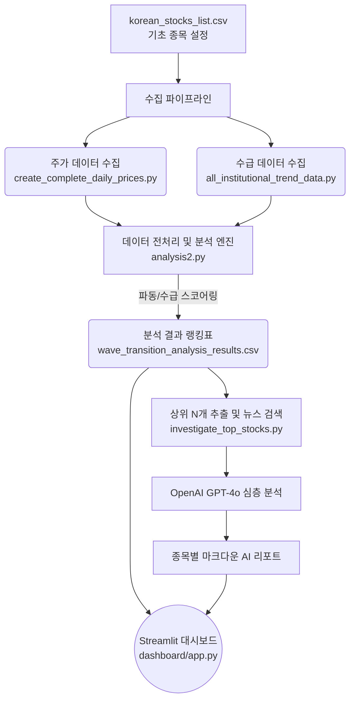

# 🥝 StockAI: 자동 기술적/수급 분석 및 AI 리포트 생성 스크리너

**StockAI**는 파이썬 기반의 한국 주식 자동화 스크리너입니다. 
단순 주가 검색을 넘어 기관/외국인의 수급 동향, 52주 신고가 추이, 단기 이동평균선 정배열(마크 미너비니, 스탠 와인스타인의 파동 변곡점 로직)을 계산하여 핵심 우량주를 발굴합니다. 스크리닝을 통과한 최상위 종목은 **GPT-4o 모델이 직접 뉴스를 스크랩하여 핵심 투자 의견 리포트**를 작성해 줍니다. 

결과물은 언제든지 **Streamlit 대시보드**를 통해 아름다운 캔들 차트와 함께 감상할 수 있습니다.

---

## 🏗 시스템 아키텍처 (Architecture)



---

## 🛠 설치 및 셋팅 (Installation & Setup)

이 프로젝트는 최신 파이썬 패키지 매니저인 `uv` 환경을 기반으로 작성되었습니다.

### 1. 패키지 설치
Repository를 클론(Clone) 받은 후, 프로젝트 최상단 디렉토리에서 라이브러리를 설치합니다.
```bash
# 관련 패키지 일괄 동기화 (requests, pandas, pykrx, openai 등)
uv sync
```

### 2. 환경 변수 셋팅 (`.env`)
안전한 키 관리를 위해 템플릿(`.env.example`) 파일을 복사하여 `.env` 파일을 생성합니다.
```bash
cp .env.example .env
```
생성된 `.env` 파일을 열고 다음과 같이 셋팅을 마쳐주세요.
```ini
# 데이터 수집 엔진 선택 (PYKRX 권장, 장애 시 NAVER로 전환)
DATA_SOURCE=PYKRX

# 추천/AI 분석을 진행할 최대 종목 수
TOP_N_ANALYZE=5

# OpenAI API 시크릿 키 (*필수)
OPENAI_API_KEY=sk-your_openai_api_key_here
```

### 3. 관심 대상 종목 설정
프로젝트 루트 디렉토리에 있는 `korean_stocks_list.csv` 파일을 열고, 매일 분석할 종목의 코드(6자리)와 이름을 원하는 만큼 구성합니다.

---

## 🚀 파이프라인 자동화 모드 실행 (Usage)

터미널에서 아래 하나의 스크립트만 실행하면 전체 파이프라인이 즉시 마법처럼 동작합니다.

```bash
uv run python run_analysis.py
```
> **동작 순서:** 
> 1) 설정된 `DATA_SOURCE`를 통해 백그라운드에서 실시간 데이터/수급 크롤링
> 2) `analysis2.py`가 파동과 기술적 스코어링을 계산
> 3) 최상위 베스트 종목들을 모아 `GPT-4o`가 실시간 뉴스를 취합해 AI 리포트 발행

---

## 📊 결과 대시보드 띄우기 (Dashboard)

데이터 엔진이 성공적으로 리포트를 생성했다면, 이를 깔끔하게 브라우저에서 볼 수 있습니다.

```bash
uv run streamlit run dashboard/app.py
```

* **투자 요약 표:** 오늘의 1등 우량주 및 전체 파동 채점표
* **인터랙티브 캔들 차트:** 마우스를 올려 직관적으로 확인하는 20일/50일 이평선 트렌드
* **AI 인사이트 서랍:** GPT-4o가 적어준 매수/매도/관망 투자 리포트 확인

---

## ⚙️ 기능 상세 및 유지보수 가이드

* **장애 대응 (Failover)**: 만약 한국거래소(krx) 쪽 포털 구조 변경으로 `PYKRX`가 오류를 뿜을 경우, 당황할 필요 없이 `.env` 파일의 `DATA_SOURCE=NAVER` 로만 바꿔주시면 자체 제작된 강력한 네이버 자동 크롤링 모듈로 즉시 전환됩니다.
* **비용 절약 관리**: `TOP_N_ANALYZE` 값을 극단적으로 줄이시면(예: 1 또는 3) 1등~3등 우량주만 골라 집중적으로 OpenAI API를 태우기 때문에 유지 비용을 대폭 아낄 수 있습니다.
